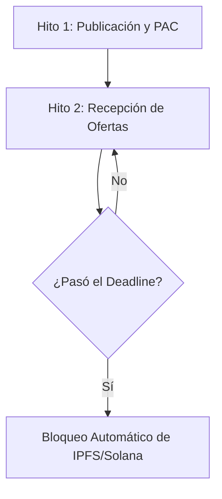

# **SCOPE OF WORK (SOW)**

## **Proyecto: IMtBProcurement Ec (Immutable Procurement MVP)**

**Sistema Inmutable y Transparente para la Fase Precontractual de Contratación Pública en Ecuador basado en Blockchain (Solana + Rust)**

## **1. Introducción y Justificación**

El ecosistema de compras públicas actual se enfrenta a desafíos críticos relacionados con la confianza, la alteración de documentos extemporáneos y la falta de auditoría en tiempo real de los plazos establecidos.

Este proyecto propone un **Producto Mínimo Viable (MVP)** que descentraliza y asegura la fase más vulnerable del proceso: **la fase precontractual**. Utilizando contratos inteligentes en **Solana (Rust/Anchor)** y un backend auxiliar en **Rocket**, se garantizará que los plazos de entrega sean inmutables, los presupuestos no sean sobrepasados y la calificación de los proveedores sea transparente para todos los oferentes participantes.

## **2. Arquitectura de la Solución (Lite)**

- **Smart Contract (Solana - Rust/Anchor):** Capa de persistencia inmutable encargado de verificar las marcas de tiempo (*timestamps*), registrar los hashes de las ofertas y bloquear adjudicaciones fraudulentas.
- **Backend (Rocket - Rust):** API intermedia encargada de estructurar los metadatos de los procesos, simular la verificación rápida de aptitudes de los proveedores y conectarse con el almacenamiento descentralizado.
- **Almacenamiento (IPFS/Pinata):** Repositorio para guardar los documentos PDF técnicos de las ofertas y los términos de referencia sin saturar la blockchain.

## **3. Flujo de Trabajo Simplificado del Proceso (Hitos o Fases Core)**

Para viabilizar el desarrollo en 6 semanas, el proceso precontractual se reduce a **3 hitos o fases secuenciales y automatizados por tiempo**:

### **Fase 1: Publicación del Proceso (Convocatoria)**

• La Institución Pública registra un proceso asignándole un identificador único, un presupuesto referencial máximo extraído de su PAC simulado, y un **Unix Timestamp (Deadline estricto)** para la entrega de ofertas.

### **Fase 2: Recepción e Inmutabilidad de Ofertas**

- Los proveedores (2 o 3 oferentes simulados) cargan su propuesta técnica.
- El sistema genera un hash criptográfico del documento y lo envía a Solana.
- **Validación de Tiempo:** Si el nodo de Solana detecta que la transacción llega un solo segundo después del *Timestamp* configurado, la blockchain rechaza la oferta automáticamente. Nadie puede "alterar el reloj" del servidor.

### **Fase 3: Apertura, Calificación y Adjudicación**

- Al vencerse el plazo, la institución ejecuta la apertura. El backend valida el nivel de *expertise* del proveedor (un campo booleano rápido: Cumple / No Cumple).
- Se emite la **Resolución de Adjudicación** en la Blockchain, haciendo público el ganador y el puntaje de todos los participantes de forma transparente.

## **4. Alcance Tecnológico Definitivo (Scope Out vs. Scope In)**

Para garantizar la entrega en el plazo establecido de 1 mes y medio, se definen estrictamente los límites del desarrollo:

| Incluido en el MVP (Scope In)   | Excluido del MVP (Scope Out)            |
|------------------------------------|-----------------------------------------|
| Registro básico de Instituciones y | Roles complejos, login con firmas       |
| Proveedores.                       | electrónicas avanzadas (ej. Token BCE). |
| Control de techo presupuestario    | Módulo contable de arrastre y cálculo   |
| (PAC base en el input).            | de saldos históricos.                   |

| Incluido en el MVP (Scope In)                                 | Excluido del MVP (Scope Out)                                                     |
|------------------------------------------------------------------|----------------------------------------------------------------------------------|
| Control estricto de fechas límites (Deadlines) en Blockchain. | Periodo de preguntas, respuestas, aclaraciones y convalidación de errores. |
| Subida de ofertas a IPFS y                                       | Módulo postcontractual (Contrato,                                                |
| persistencia del hash en Solana.                                 | garantías, entrega-recepción, pagos).                                            |
| Visualización básica del                                         | Gráficos estadísticos complejos o                                                |
| estado/hito actual del proceso.                                  | integraciones reales con el SERCOP.                                              |

## **5. Cronograma de Ejecución (6 Semanas de Código)**

### • **Semana 1-2: Capa Blockchain (Solana/Anchor)**

- o Diseño de las estructuras de datos (*Accounts*) del Proceso, Oferta e Institución.
- o Programación de las reglas de negocio (Validación de presupuestos y candados de tiempo).

### • **Semana 3-4: Capa de Integración y Almacenamiento (Rust/Rocket + IPFS)**

- o Creación de los endpoints en Rocket para conectar con el Frontend.
- o Integración del SDK de Pinata para subir los documentos de las ofertas.

### • **Semana 5-6: Frontend y Pruebas de Estrés**

- o Diseño de la interfaz de usuario para simular el ciclo de vida (Ver el hito actual).
- o Simulación del flujo con 2 procesos y 3 oferentes para demostrar el "No Cumple" y el rechazo de ofertas atrasadas.
- **Semana 7-8 (Margen de Seguridad):** Documentación final, redacción de tesis/reporte y filmación del video demostrativo.

# **INGENIERÍA DE DETALLE: IMtBProcurement (Immutable Procurement)**

## **FASE 1: PUBLICACIÓN DEL PROCESO (CONVOCATORIA)**

En esta fase inicial, la institución pública define de manera transparente e inalterable las "reglas del juego" y las condiciones técnicas de la licitación dentro de la Blockchain. Debido a la arquitectura descentralizada de Solana, toda la información se almacena en estructuras de datos aisladas denominadas *Accounts*.

### **1. Arquitectura de Interacción (Fase 1)**

El siguiente diagrama de bloques describe el flujo de inicialización del PAC y la posterior apertura de una convocatoria pública:

```mermaid
graph TD
    subgraph Capa_Inicializacion ["Capa de Inicializacion (Semilla)"]
        A[Script de Configuracion] -->|Inyecta Techo PAC| B[(Solana: Institution Account)]
    end

    subgraph Flujo_Convocatoria ["Flujo de Convocatoria (Rocket & Web3)"]
        C[Institucion Publica] -->|Sube TDR PDF y Datos| D[API Backend: Rocket]
        D -->|1. Pinning Documento| E[Almacenamiento: IPFS / Pinata]
        E -->|2. Retorna CID Hash| D
        D -->|3. Invoca initialize_process| F[Solana: Smart Contract / Program]
        F -->|4. Valida Presupuesto y Reloj| B
        F -->|5. Si cumple, descuenta y crea| G[(Solana: ProcurementProcess Account)]
    end

    style B fill:#111,stroke:#00FFA3,stroke-width:2px
    style G fill:#111,stroke:#00FFA3,stroke-width:2px
    style F fill:#111,stroke:#00E0FF,stroke-width:2px
```    

### **2. Inicialización del Entorno y Datos Semilla (PAC)**

Dado que el sistema arranca en un estado vacío (stateless), el Producto Mínimo Viable (MVP) utilizará un script de inicialización (seed script) ejecutado al momento del despliegue. Este script leerá una configuración base con dos o tres instituciones públicas ficticias para simular el Plan Anual de Contratación (PAC) inicial.

Una vez ejecutado el script, estos valores numéricos se grabarán de forma persistente dentro de la red de Solana, quedando blindados contra modificaciones externas o alteraciones manuales en los archivos del servidor.

### **3. Estructuras de Datos en Rust (Anchor Accounts)**

Para representar esta fase en la cadena de bloques, el programa nativo de Solana definirá dos estructuras de datos principales bajo el atributo `#[account]`:

#### **A. Cuenta de la Institución Pública (`Institution`)**

Representa el perfil inmutable de la entidad contratante y actúa como el validador contable del presupuesto:

* `authority:Pubkey` (La clave pública o Wallet criptográfica oficial de la institución que firma las transacciones).
* `name: String` (Nombre oficial de la entidad gubernamental; ej. "Municipio de Quito").
* `pac_budget_limit: u64` (El presupuesto techo anual asignado y aprobado en su PAC).
* `pac_budget_spent: u64` (El acumulado financiero comprometido en procesos anteriores).

#### **B. Cuenta del Proceso de Contratación (`ProcurementProcess`)**

Cada licitación individual que se lance de manera exitosa creará una instancia única de esta estructura en la Blockchain:

- `id: u64` (Código único e incremental del proceso de contratación; ej. 2026001).
- `institution: Pubkey` (Enlace criptográfico directo a la cuenta de la institución que publica la oferta).
- `title: String` (Nombre del objeto de contratación; ej. "Adquisición de Equipos de Cómputo").
- `referential_budget: u64` (El costo estimado máximo asignado para este proceso específico).
- `deadline: i64` (El Unix Timestamp exacto en segundos en el cual se bloqueará de forma absoluta la recepción de ofertas).
- `status: u8` (Un código de estado del ciclo de vida: 0 = Convocatoria, 1 = Cerrado para Evaluación, 2 = Adjudicado).
- `ipfs_tdr_hash: String` (El hash CID único devuelto por IPFS que apunta al documento PDF inalterable de los Términos de Referencia —TDR—).

### **4. Lógica del Negocio y Candados en el Smart Contract (Solana)**

Cuando la institución pública invoque la instrucción `initialize_process` a través de la interfaz web, el programa en Rust ejecutará las siguientes validaciones matemáticas a nivel de protocolo antes de autorizar la escritura en la Blockchain:

- **Validación y Control del Techo Presupuestario (PAC):** El contrato inteligente leerá el estado actual de la institución y verificará que el presupuesto requerido no rompa el límite anual aprobado mediante la siguiente condición:

$$(\text{pac\_budget\_spent} + \text{referential\_budget}) \le \text{pac\_budget\_limit}$$

Si la suma del presupuesto referencial más el acumulado histórico de gasto supera el límite del PAC, la transacción será revertida inmediatamente por la red emitiendo un error personalizado de tipo `BudgetExceeded`.

- **Validación de Tiempo Inicial:** El deadline o fecha límite configurada para la recepción de ofertas obligatoriamente debe ser un momento futuro en el tiempo. El Smart Contract extraerá el tiempo real del reloj de los validadores de Solana mediante el Sysvar correspondiente, evaluando la expresión:

$$\text{deadline} > \text{current\_timestamp}$$

- **Actualización Automática y Retención del Saldo:** Si todas las condiciones previas son válidas, el programa procederá a retener el presupuesto, actualizando el acumulado histórico de la institución directamente en la blockchain:

$$\text{pac\_budget\_spent} \leftarrow \text{pac\_budget\_spent} + \text{referential\_budget}$$

Esto garantiza un control estricto de saldos. Si el Municipio de Quito posee un límite de $\$50,000.00$ y publica un proceso de $\$20,000.00$, su cuenta de estado se reescribirá automáticamente a $\$20,000.00$ gastados, dejando un saldo real remanente de $\$30,000.00$ inalterable para futuras licitaciones.

### **5. Orquestación en el Backend (Rocket)**

El backend desarrollado en Rocket actuará como una API de paso y procesamiento intermedio:

1. Recibirá los datos planos del formulario web y el archivo digital PDF de los Términos de Referencia (TDR).
2. Interactuará con la infraestructura descentralizada de almacenamiento subiendo el archivo a IPFS a través del servicio de pinning de Pinata, recuperando el código hash CID.
3. Empaquetará el CID de IPFS junto con las variables numéricas procesadas, firmará la transacción con las credenciales correspondientes y la inyectará en la red de Solana para interactuar con el Program de Rust.

## **FASE 2: RECEPCIÓN E INMUTABILIDAD DE OFERTAS (EL CANDADO DE TIEMPO)**

Con la convocatoria abierta y registrada de forma transparente en la Blockchain, se activa el periodo de postulación para los proveedores del Estado (oferentes). El objetivo de esta fase es blindar la integridad de los documentos y asegurar el cumplimiento estricto de los cronogramas.

### **1. Arquitectura de Interacción (Fase 2)**

El siguiente diagrama describe cómo un proveedor sube su propuesta técnica y cómo la Blockchain actúa como un sello de tiempo criptográfico inalterable:

```mermaid
graph TD
    subgraph Entorno_Usuario ["Capa del Proveedor"]
        A[Proveedor / Oferente] -->|Carga Oferta PDF| B[Interfaz Web Frontend]
    end

    subgraph Middleware_Procesamiento ["Orquestacion Rocket"]
        B -->|Envía Archivo| C[API Backend: Rocket]
        C -->|1. Pinning de Propuesta| D[Almacenamiento: IPFS / Pinata]
        D -->|2. Retorna CID de Oferta| C
    end

    subgraph Capa_Criptografica ["Validacion Blockchain (Solana)"]
        C -->|3. Invoca submit_offer| E[Solana: Smart Contract / Program]
        F[(Solana: ProcurementProcess Account)] -->|4. Provee Deadline| E
        E -->|5. ¿Current_Time <= Deadline?| G{Validador de Tiempo}
        G -->|No: Aborta Transaccion| H[Error: OfferSubmissionClosed]
        G -->|Si: Registra| I[(Solana: PDA OfferAccount)]
    end

    style F fill:#111,stroke:#00FFA3,stroke-width:2px
    style I fill:#111,stroke:#00FFA3,stroke-width:2px
    style E fill:#111,stroke:#00E0FF,stroke-width:2px
```

### **2. Estructura de Datos en Rust (Anchor Accounts)**
Para almacenar los metadatos de las ofertas de forma descentralizada, el programa en Rust definirá la siguiente estructura de datos bajo el atributo `#[account]`:

#### **Cuenta de la Oferta (OfferAccount)**

- `provider: Pubkey` (La clave pública o Wallet criptográfica del proveedor oferente que firma la transacción).
- `process_id: u64` (El identificador numérico de la licitación a la que está postulando).
- `ipfs_proposal_hash: String` (El hash CID único devuelto por IPFS que apunta al documento PDF inalterable de su propuesta técnica).
- `submission_timestamp: i64` (El Unix Timestamp exacto en segundos registrado por el consenso de los nodos de Solana al recibir la oferta).
- `expertise_verified: bool` (Un campo booleano inicializado por defecto en `false`, el cual será evaluado en la siguiente fase de calificación).

### **3. Lógica del Negocio y Candado de Tiempo Criptográfico (Solana)**

Cuando un proveedor ejecuta la instrucción submit_offer, el Smart Contract en Rust/Anchor realizará la validación de seguridad más importante de todo el sistema de contratación pública:

- **Validación Estricta del Deadline**: El contrato inteligente leerá la cuenta de estado del proceso (`ProcurementProcess`) y extraerá el tiempo real de la red a través del Sysvar del reloj de los validadores de Solana, evaluando la siguiente expresión:

$$\text{current\_timestamp} \le \text{deadline}$$

Si el reloj interno de la Blockchain marca un solo segundo posterior a la fecha límite configurada ($\text{current\_timestamp} > \text{deadline}$), la transacción es abortada de inmediato y los fondos se revierten, emitiendo el error crítico personalizado: `OfferSubmissionClosed`.

- **Incorruptibilidad del Sistema**: A diferencia de las bases de datos tradicionales donde un administrador del sistema o un atacante con acceso al servidor web puede alterar la hora local para ingresar documentos extemporáneos, en Solana el tiempo es determinado por el consenso de miles de nodos globales (`Clock::get()?.unix_timestamp`). Si la red determina que el tiempo expiró, ninguna autoridad humana puede forzar la entrada de la oferta.

## **FASE 3: APERTURA, CALIFICACIÓN Y ADJUDICACIÓN DIRECTA**

Esta es la fase de cierre del ciclo de vida de nuestro MVP de contratación pública. Una vez expirado el plazo inmutable de la Fase 2, la institución pública ejecuta la apertura de los sobres digitales, realiza la validación técnica automatizada y emite la resolución final de adjudicación directamente en la Blockchain.

###1. **Arquitectura de Interacción (Fase 3)**

El siguiente diagrama describe cómo se procesan las ofertas almacenadas en las cuentas PDA de Solana, cómo el Smart Contract ejecuta las reglas de negocio de evaluación y cómo se asienta el hito final de adjudicación:

```mermaid
graph TD
    subgraph Gestion_Institucional ["Capa Institucional"]
        A[Institucion Publica] -->|Accion: Abrir y Calificar| B[Interfaz Web Frontend]
    end

    subgraph Procesamiento_Intermedio ["Orquestacion Rocket"]
        B -->|Peticion de Apertura| C[API Backend: Rocket]
        C -->|1. Consulta Documentacion de Soporte| D[Almacenamiento: IPFS]
    end

    subgraph Consenso_Adjudicacion ["Cierre en Blockchain (Solana)"]
        C -->|2. Invoca evaluate_and_award| E[Solana: Smart Contract / Program]
        F[(Solana: ProcurementProcess Account)] -->|3. Verifica Estado y Bloqueo| E
        G[(Solana: PDA OfferAccounts)] -->|4. Evalua Atributo Expertise| E
        E -->|5. Cambia Estado Proceso a Adjudicado| F
        E -->|6. Registra Ganador Inmutable| H[(Solana: AwardResolution Account)]
    end

    style F fill:#111,stroke:#00FFA3,stroke-width:2px
    style G fill:#111,stroke:#00FFA3,stroke-width:2px
    style H fill:#111,stroke:#00FFA3,stroke-width:2px
    style E fill:#111,stroke:#00E0FF,stroke-width:2px
```

###2. **Estructuras de Datos en Rust (Anchor Accounts)**

Para asentar la resolución del proceso con máxima transparencia, el programa de Solana actualizará los estados previos y creará una nueva cuenta definitiva de auditoría bajo el atributo `#[account]`: 

#### **Cuenta de la Resolución de Adjudicación (`AwardResolution`)**

- `process_id: u64` (El identificador del proceso de contratación pública cerrado).
- `winner_provider: Pubkey` (La clave pública o Wallet criptográfica del oferente que ganó la licitación).
- `winning_bid_hash: String` (El hash CID de IPFS que apunta al documento PDF de la oferta ganadora).
- `final_score_hash: String` (El hash CID de IPFS que contiene el acta firmada digitalmente con el desglose de puntajes de todos los participantes).
- `timestamp: i64` (El Unix Timestamp exacto en segundos del momento de la adjudicación, validado por la red).

###3. **Lógica del Negocio y Candados en el Smart Contract (Solana)**

Cuando la institución invoca la instrucción evaluate_and_award, el Smart Contract escrito en Rust ejecuta tres candados lógicos clave antes de firmar la resolución:

- **Validación de Fase Temporal (Candado Post-Deadline)**: El Smart Contract verifica que el tiempo actual del validador de Solana sea estrictamente superior al deadline del proceso ($\text{current\_timestamp} > \text{deadline}$). Esto impide físicamente que una institución pública adjudique un contrato "a dedo" antes de que todos los competidores hayan tenido la oportunidad de subir sus ofertas en los plazos legales.
- **Filtro Automatizado de Cumplimiento Técnico (Simulado)**: Aprovechando la lógica de los proyectos de diplomas de tus compañeros, el backend lee los campos estructurados de las ofertas. Si el atributo `expertise_verified` de un proveedor está marcado como `false` (debido a que su documentación de soporte no cumple los requerimientos de la convocatoria), el Smart Contract lo descarta automáticamente de la competencia con la etiqueta de **No Cumple**.
- **Cierre Inmutable del Proceso**: El contrato cambia el estado del `ProcurementProcess` (`status` $\leftarrow$ `2` [Adjudicado]) y guarda la `AwardResolution`. A partir de este segundo, la resolución se vuelve pública y de acceso abierto. Cualquier oferente descalificado o ciudadano puede auditar la transacción en el explorador de Solana, garantizando que el ganador fue seleccionado bajo reglas matemáticas transparentes.

### **4. Orquestación en el Backend (Rocket) y Frontend**

1. **El Servidor (Rocket):** Al activarse el hito de apertura, Rocket recopila los hashes CID de IPFS de las ofertas técnicas enviadas, simula la verificación de aptitudes con los "diplomas o registros de experticia previos", y marca el flag de `expertise_verified` en las ofertas respectivas.
2. **El Frontend (Interfaz Gráfica):** Para cumplir con tu requerimiento de visualización rápida del hito, la interfaz gráfica lee el campo status directamente desde la blockchain de Solana y pinta de forma dinámica una barra de progreso que cambia visualmente de `[Convocatoria Abierta]` $\rightarrow$ `[Recepción Cerrada]` $\rightarrow$ `[Proceso Adjudicado]`.